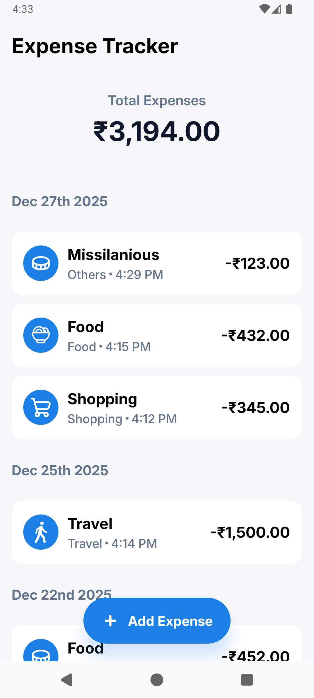
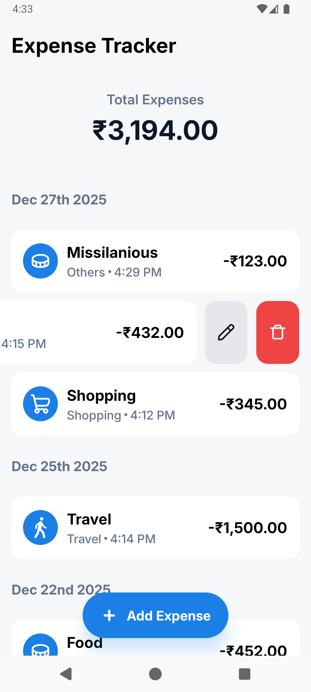
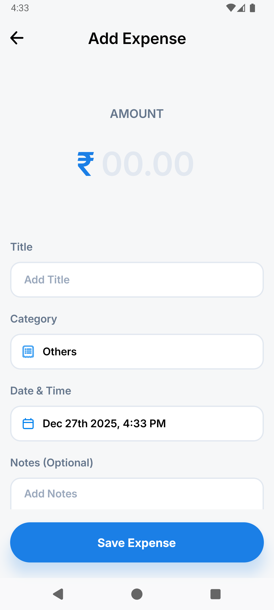
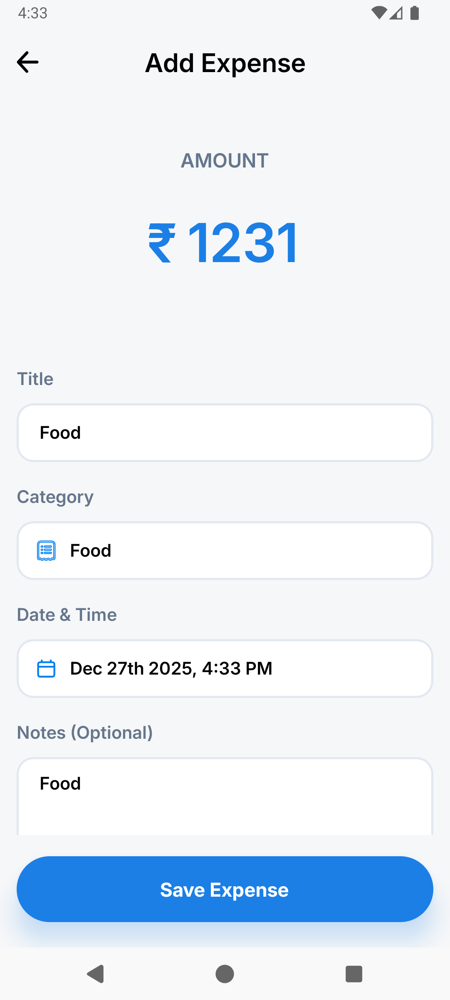

# Expense Tracker App

A React Native mobile application to track daily expenses, with animations and form validation.

---

## 📸 Screenshots

  
  
  
  
  

---

## Tech Stack

- React Native
- TypeScript
- Redux Toolkit
- React Navigation
- Moment.js
- React Native Snackbar

---

## Prerequisites

Make sure you have the following installed React-Native Locally:

https://reactnative.dev/docs/environment-setup

---

## Run App

# Clone the Project

git clone https://github.com/kanthvagale/ExpenseTracker.git

# change directory

cd expense-tracker

# Install Dependancies

npm install

# Run Android

npx react-native run-android

# Run IOS

sudo gem install cocoapods

cd ios

pod install

cd ..

npx react-native run-ios

# Make sure to run metro before running ios or android

npx react-native start
